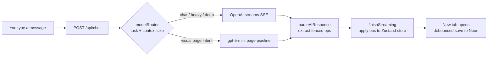

<div align="center">

# ▎▎▎▎ Primy

### The AI workspace for docs, sheets, and decks.

**Chat to create and edit them all. Drag in any file. Project memory keeps everything connected, so you never copy-paste from ChatGPT again.**

<br/>


</div>

---

## ✦ What is Primy?

Primy is an AI-native workspace where **documents, spreadsheets, presentation decks, and HTML pages** all live inside one project and talk to the same chat assistant. Ask it to draft a doc, fill a sheet, generate a deck, or turn an idea into a one-pager. It reads your project's memory, so every artifact stays connected.

No tab-switching between five tools. No copy-pasting from a chatbot in another window. You describe what you want, and the right artifact appears in front of you, fully editable.

> **Clean. Smart. Approachable.** A sharp tool that doesn't need a manual.

---

## ✦ Four artifacts, one chat

| | Entity | What it is | Powered by |
|---|---|---|---|
| 📄 | **Document** | Rich text, Markdown, inline Mermaid diagrams | Plate.js v52 (Slate) |
| 📊 | **Spreadsheet** | Full grid, formulas, AI-filled tables | Univer |
| 🎞️ | **Deck** | Presentation slides with themes, PPTX + PDF export | Custom slide engine + pptxgenjs / Puppeteer |
| 🌐 | **Page** | Sanitized, editable HTML one-pagers and landing pages | gpt-5-mini visual pipeline |

Entities group into **folders** inside a **project (workspace)**. A document can even hop workspaces, the "Quick Note → Move to workspace" promote path.

---

## ✦ How a message becomes an artifact



1. **Context injection** packs in relevant sheet CSV, doc content, and project memory.
2. **`modelRouter.ts`** picks the model by task, auto-promoting to a heavier model past a 30KB context threshold, and escalating by *intent* (complex reasoning → `chat-deep`, visual page → `page-generate`).
3. The AI streams JSON operations inside fenced blocks (`sheetops`, `docops`, `deckops`, `pageops`, ...).
4. **`parseAIResponse.ts`** extracts them with layered fallback strategies (even salvaging unfenced JSON).
5. The store applies the ops, opens the artifact, and debounce-saves to the database.

---

## ✦ The AI brain

**OpenAI is the sole provider routed today** (a Google/Gemini client is wired but dormant). Model selection is task-keyed, not a global switch:

| Task | Model | Why |
|---|---|---|
| `chat` / `chat-heavy` | gpt-4.1 | Everyday create + edit |
| `chat-deep` | gpt-5.5 | Complex reasoning |
| `page-generate` | gpt-5-mini | Visual HTML pages (~6× cheaper, ~40% faster than 5.5 at near-equal design quality) |
| `deck-generate` / `deck-edit` | gpt-4.1 | Slide authoring |
| `deck-critique` | gpt-4.1 | Agentic critique → repair pass |
| `title` / `web-search` | gpt-4.1-mini | Fast utility calls |
| `embedding` | text-embedding-3-small | Semantic context relevance |

`contextRelevance.ts` scores every doc and table by keyword match plus optional embedding similarity, injecting the top hits in full and the rest as summaries.

---

## ✦ Beyond the workspace

- **Library** — your workspaces lensed by ownership: *Created by me* vs *Shared with me*, each card summarizing its contents.
- **Quick Note** — frictionless capture into a dedicated hidden Quick Notes workspace, promotable into any project.
- **Project activity feed** — an append-only log of high-signal team events (created / shared / invited / joined), best-effort and never able to break the action that triggered it.
- **Multi-tenant orgs** — Owner / Admin / Member roles, private-by-default sharing, company-paid billing via an org flag.
- **Trash + snapshots** — soft-delete with restore, plus artifact version history and scheduled pruning.
- **Auth hardening** — revocable sessions (`tokenVersion`), durable login throttle, breached-password checks, password reset, passwordless login codes, and "log out everywhere".

---

## ✦ Tech stack

- **Framework** — Next.js 16 (App Router) + React 19 + TypeScript
- **Styling** — Tailwind CSS v4 with CSS-variable theming and a full end-to-end dark mode
- **Database** — Drizzle ORM + Neon PostgreSQL (serverless)
- **Auth** — NextAuth v5 (credentials + JWT)
- **Client state** — Zustand v5 + Immer, debounced sync to server
- **Server state** — TanStack Query v5
- **AI** — Vercel AI SDK 6 (`@ai-sdk/openai`, `@ai-sdk/google`)
- **Editors** — Plate.js (docs), Univer (sheets), custom slide system (decks)
- **Export** — pptxgenjs + Puppeteer/Chromium for PDF

---

## ✦ Design language

A **Strut-inspired warm shell**: black wordmark + ink `#1A1815`, warm near-white surfaces, and amber `#FFB43F` as the single warm accent for AI signal and highlights. Workspace identity shows up as candy-colored dots; entity icons stay monochrome.

Motion is spring-based and fast (sub-300ms micro-interactions), animating only `transform` / `opacity` / `filter`, always degrading under `prefers-reduced-motion`, and enforced by `npm run lint:motion`.

Type is **Inter** for UI and body, **Geist Mono** for code.

---

## ✦ Quickstart

```bash
# 1. Install
npm install

# 2. Configure your environment (see below)
cp .env.example .env.local   # then fill in the values

# 3. Apply the schema
npm run db:migrate

# 4. (optional) Seed a local dev admin: admin@primy.local / admin
npm run dev:admin

# 5. Run it
npm run dev
```

### Environment variables (`.env.local`)

| Variable | Required | Purpose |
|---|:---:|---|
| `DATABASE_URL` | ✅ | Neon PostgreSQL connection string |
| `NEXTAUTH_SECRET` | ✅ | JWT signing secret |
| `NEXTAUTH_URL` | ✅ | App URL (e.g. `http://localhost:3000`) |
| `OPENAI_API_KEY` | ✅ | The only provider routed today |
| `BLOB_READ_WRITE_TOKEN` | ✅ | Vercel Blob storage for uploads |
| `GEMINI_API_KEY` | — | Read for a dormant Google client |
| `NEXT_PUBLIC_DEV_AUTH_BYPASS` | — | Dev only, auto-signs-in as dev admin. **Never set in production.** |

---

## ✦ Scripts

| Command | What it does |
|---|---|
| `npm run dev` | Dev server (Turbopack) |
| `npm run build` | Production build |
| `npm run lint` / `lint:motion` | ESLint / motion-ruleset check |
| `npm run test:run` | Vitest (single run, CI) |
| `npm run db:generate` / `db:migrate` / `db:check` | Drizzle migration workflow |
| `npm run dev:admin` | Seed/refresh the local dev admin |
| `npm run seed:demo` | Seed demo data |

---

## ✦ Repo map

```
src/
├── app/api/            # App Router endpoints (chat, projects, orgs, trash, ...)
├── components/
│   ├── shell/v2/       # AppShellV2 — the active shell (Library, Quick Notes, board)
│   ├── workspace/      # ProjectActivity and per-project chrome
│   └── ui/transitions/ # Drop-in micro-interaction primitives
├── lib/
│   ├── store.ts        # Single Zustand source of truth for all client state
│   ├── ai/             # systemPrompt, parseAIResponse, modelRouter, deck pipeline
│   ├── activity.ts     # Append-only project activity log
│   └── projectAccess.ts# Team-SSOT access gate
└── db/schema.ts        # Drizzle table definitions
```

Deeper context lives in [`/documents`](./documents) (platform docs, ICPs, style guide, motion ruleset, vision) and project guidance in [`CLAUDE.md`](./CLAUDE.md).

---

<div align="center">
<sub>Built with care. Black wordmark, amber spark, warm near-white everywhere.</sub>
</div>
